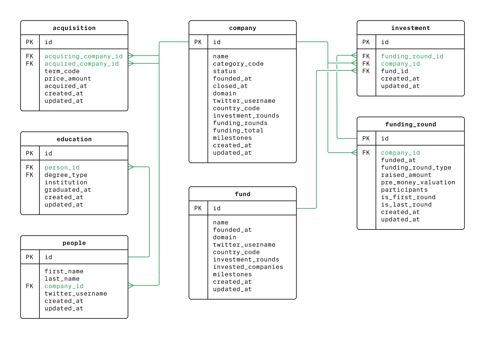

#SQL Business Intelligence Analysis Challenges

## Overview

This repository showcases a collection of 10 SQL queries designed to solve various analytical business problems. The queries operate on a relational database schema (detailed below) that models company investments, operations, funding rounds, personnel, and educational backgrounds. This project demonstrates proficiency in a range of SQL techniques including data retrieval, filtering, aggregation, joins, subqueries, conditional logic, and text pattern matching.

## Database Schema (ER Diagram)

The database consists of several interconnected tables including `company`, `fund`, `people`, `acquisition`, `funding_round`, `education`, and `investment`, modeling the relationships between these entities.

## SQL Challenges & Solutions

This project addresses 10 distinct analytical questions using SQL. Each solution is provided in a separate `.sql` file and is summarized below.

---

### Question 1: Startup Landscape Overview

* **Business Problem:** To understand the overall startup landscape by providing a snapshot of how many companies have failed versus how many are still operating or have been acquired, starting with counting closed companies.

* **SQL Solution File:** [`01_Landscape_Analysis_closed.sql`](./01_Landscape_Analysis_closed.sql) 

* **Key SQL Concepts:** `SELECT`, `COUNT aggregation`, `WHERE clause`

* **Output Notes:** This query calculates the number of companies marked as 'closed'.

---

### Question 2: Sector Funding Analysis for US Investors

* **Business Problem:** To analyze historical funding amounts for companies in a specific sector (news) and country (USA), sorted to highlight top-funded entities, aiding in investment benchmarking.

* **SQL Solution File:** [`02_Sector_Analysis_US_News_Funding.sql`](./02_Sector_Analysis_US_News_Funding.sql)

* **Key SQL Concepts:** `SELECT with multiple columns`, `WHERE with AND`, `ORDER BY DESC`

* **Output Notes:** Lists US-based news companies and their total funding, ordered from highest to lowest.

---

### Question 3: Analysis of Cash Acquisitions

* **Business Problem:** To calculate the total monetary value of company acquisitions made specifically with cash within a defined multi-year period (2011-2013).

* **SQL Solution File:** [`03_Total_Cash_Acquisition_2011_2013.sql`](./03_Total_Cash_Acquisition_2011_2013.sql) 

* **Key SQL Concepts:** `SUM aggregation`, `WHERE with multiple conditions (text and date range)`

* **Output Notes:** Outputs a single sum representing the total value of cash acquisitions in the specified period.

---

### Question 4: Identifying Industry Influencers by Twitter Handle

* **Business Problem:** To identify and list individuals based on specific patterns in their social media identifiers, such as Twitter usernames starting with 'Silver', for targeted outreach.

* **SQL Solution File:** [`04_Identify_Silver_Twitter_Users.sql`](./04_Identify_Silver_Twitter_Users.sql)

* **Key SQL Concepts:** `SELECT multiple columns`, `WHERE with LIKE operator (suffix wildcard '%')`

* **Output Notes:** Provides a list of first names, last names, and Twitter usernames for individuals matching the criteria.

---

### Question 5: Targeted Search for Finance Influencers

* **Business Problem:** To perform a highly targeted search for individuals based on combined criteria: a keyword ('money') within their Twitter usernames and a specific starting letter ('K') for their last names.

* **SQL Solution File:** [`05_Finance_Influencers_Money_K.sql`](./05_Finance_Influencers_Money_K.sql)

* **Key SQL Concepts:** `SELECT *`, `WHERE with multiple LIKE conditions (infix and suffix wildcards)`, `AND operator`

* **Output Notes:** Retrieves all available information for individuals who match both text patterns.

---

### Question 6: Geographic Investment Funding Analysis

* **Business Problem:** To calculate and rank the total investment funding raised by companies, segmented by their country of registration, to identify key investment hotspots globally.

* **SQL Solution File:** [`06_Geographic_Funding_Totals.sql`](./06_Geographic_Funding_Totals.sql)

* **Key SQL Concepts:** `GROUP BY`, `SUM aggregation`, `SELECT with aggregate and grouping columns`, `ORDER BY aggregated alias`

* **Output Notes:** Presents a list of countries and the total funding raised by companies in each, sorted by the funding amount.

---

### Question 7: Funding Round Volatility Analysis

* **Business Problem:** To identify dates with significant variation between the smallest and largest funding rounds, excluding days with zero funding or no variation, to highlight market volatility.

* **SQL Solution File:** [`07_Funding_Round_Volatility.sql`](./07_Funding_Round_Volatility.sql) 

* **Key SQL Concepts:** `GROUP BY (potentially on date part of datetime)`, `MIN aggregation`, `MAX aggregation`, `HAVING clause with multiple conditions`

* **Output Notes:** Shows dates along with the lowest and highest funding amounts for days meeting the volatility criteria.

---

### Question 8: Venture Fund Activity Level Classification

* **Business Problem:** Categorize venture funds into predefined activity levels (high, middle, low) based on the number of companies they've invested in, for easier segmentation and analysis.

* **SQL Solution File:** [`08_Venture_Funding_By_Activity.sql`](./08_Venture_Funding_By_Activity.sql) 

* **Key SQL Concepts:** `CASE statement for conditional logic`, `SELECT all original columns plus derived column`

* **Output Notes:** Displays all fund information along with a new 'activity_category' field.

---

### Question 9: Investment Strategy by Fund Activity Level

* **Business Problem:** To analyze how the average number of investment rounds funds participated in varies across different pre-assigned fund activity levels, to uncover strategic investment patterns.

* **SQL Solution File:** [`09_Categorized_Average_Rounds_By_Activity.sql`](./09_Categorized_Average_Rounds_By_Activity.sql)

* **Key SQL Concepts:** `Common Table Expression (CTE) for multi-step logic`, `CASE statement (within CTE)`, `AVG aggregation`, `ROUND function`, `GROUP BY derived category`

* **Output Notes:** Shows each activity category and the rounded average number of funding rounds for funds in that category, sorted by the average.

---

### Question 10: Employee Education Impact at Failed Startups

* **Business Problem:** To investigate potential correlations between employee education levels and startup outcomes by calculating the average number of degrees for employees (who have education records) at companies that closed after a single specific funding round.

* **SQL Solution File:** [`10_Impact_Of_Education_At_Failed_Startups.sql`](./10_Impact_Of_Education_At_Failed_Startups.sql)

* **Key SQL Concepts:** `Nested Subqueries for complex filtering`, `INNER JOIN`, `COUNT aggregation`, `AVG aggregation`, `GROUP BY`

* **Output Notes:** Calculates a single average representing the number of degrees per educated employee at the specifically defined failed startups.

---

## Summary of SQL Skills Demonstrated

* Data Retrieval and Filtering (`SELECT`, `FROM`, `WHERE`, `AND`)

* Aggregate Functions (`COUNT`, `SUM`, `AVG`, `MIN`, `MAX`)

* Grouping and Filtering Groups (`GROUP BY`, `HAVING`)

* Pattern Matching (`LIKE` with wildcards)

* Conditional Logic (`CASE` statements)

* Joins (`INNER JOIN`)

* Subqueries (Nested, in `WHERE IN` clauses)

* Common Table Expressions (CTEs)

* Data Type Casting (`CAST`)

* Sorting Results (`ORDER BY`)

* Date Range Filtering and Date Handling Considerations

* Rounding Numerical Results (`ROUND`)

## Tools Used

* SQL (Standard dialect, adaptable to various RDBMS)

* VS Code (for SQL script editing and documentation)

* GitHub (for version control and project presentation)

---

*Created by [Ian Titus](https://www.linkedin.com/in/ian-titus/)*